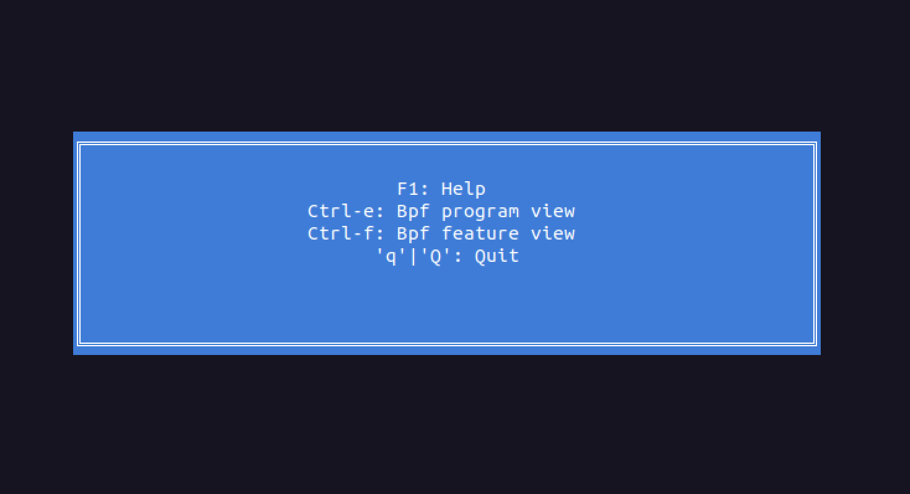
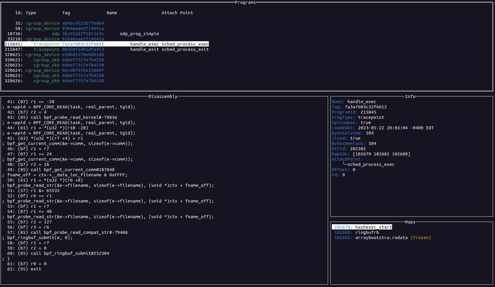
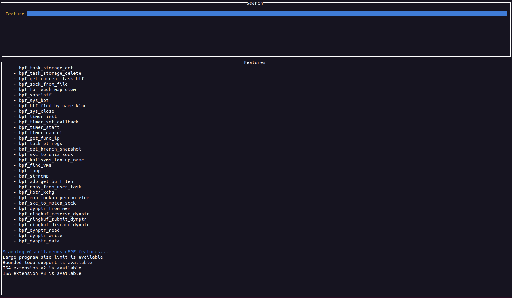
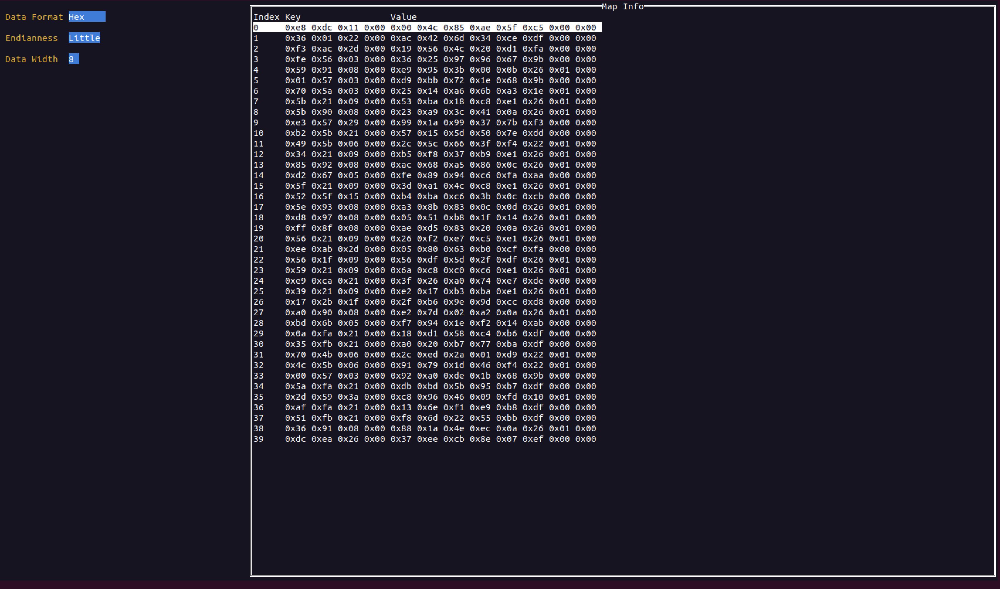
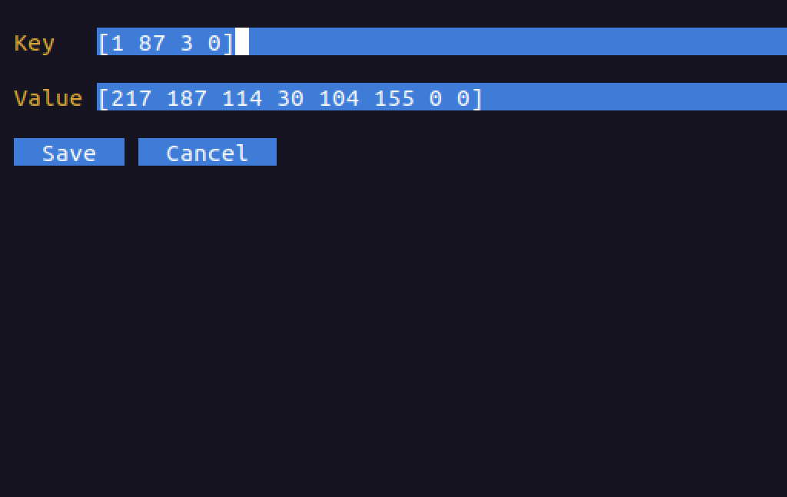

# ebpfmon
ebpfmon is a tool for monitoring [eBPF](https://ebpf.io/what-is-ebpf/) programs. It is designed to be used with [bpftool](https://github.com/libbpf/bpftool) from the linux kernel. ebpfmon is a TUI (terminal UI) application written in Go that allows you to do real-time monitoring of eBPF programs.

# Installation
Right now the only supported way to install ebpfmon is to build it from source.

## Dependencies
First and foremost this tool is written in [Go](https://go.dev/learn/) so you will need to have that installed and in your PATH variable. It should work on go 1.18 or later although it's possible it could work on earlier versions. It just hasn't been tested

Next, make sure to install the following dependencies.

### Required dependencies
- bpftool (installed from a package manager or built from source). This is what ebpfmon uses to get information regarding eBPF programs, maps, etc
- libelf
- zlib

### Optional (but highly recommended) dependencies
- libcap-devel
- libbfd

### Optional dependencies for additional features
- clang
- llvm

### Ubuntu 20.04+
To install all the dependencies run the following command:
```bash
$ sudo apt install linux-tools-`uname -r` libelf-dev zlib1g-dev libcap-dev clang llvm binutils-dev
```

### Amazon Linux 2
To install all the dependencies run the following command:
```bash
$ sudo yum install elfutils-libelf-devel libcap-devel binutils-devel clang bpftool
```

### Rhel, CentOS, Fedora
To install all the dependencies run the following command:
```bash
$ sudo dnf install elfutils-libelf-devel libcap-devel zlib-devel binutils-devel clang bpftool
```

### Debian 11 
```bash
$ sudo apt install bpftool libelf-dev zlib1g-dev libcap-dev binutils-dev clang llvm  
```

## Building
Simply run the following commands. This will build the `ebpfmon` binary in the current directory
```bash
$ git clone https://github.com/redcanaryco/ebpfmon.git
$ cd ebpfmon
$ make
```

# Usage
```bash
$ ./ebpfmon
```

NOTE: `bpftool` needs root privileges and so ebpfmon will run `sudo bpftool ...`.
This means you will likely be prompted to enter your sudo password.

# Documentation
## Basic navigation
The main view for ebpfmon is the program view. This view shows all the eBPF
programs that are currently loaded on the system. Each pane is selectable and
you can swith between panes by using the `tab` key. In a given pane you can use
the arrow keys to move the scroll the text or list selection up and down.
For lists such as the programs or maps you can press enter to select. Selecting
a program will populate the other other panes with information about that
program. Selecting a map will switch to a map entry view that shows the entries
for that map.

## Keybindings
There are a few keybindings that are available in ebpfmon. These are listed
on the help page which can be access by pressing the `F1` key or the `?` key
<p text-align="center">
    
</p>

## Program View
To access the program view regardless of which view you are on you can press `Ctrl` and `e`. 
<p text-align="center">
    
</p>

## Bpf feature view
To access the bpf feature view regardless of which view you are on you can press `Ctrl` and `f`.
<p text-align="center">
    
</p>

## Map views
To access the map view simply select a map (if one exists) for the current eBPF program. This will populate the map view with the map entries. In the map view you can format the map entry data in various ways. You can also delete map entries by pressing the `d` key.

<p text-align="center">
    
</p>

 You can also edit map entries by pressing `enter` on a selection
 <p text-align="center">
    
</p>

## Quitting
To quit the application you can press `q` or `Q`

## Going back
Generally the escape key should take you back to the previous view you were on. Also, if you are in the help view or error view pressing escape should return you to the previous windows

## Command Line Arguments
### `-bpftool`
Allows you to specify the path to the bpftool binary. This is useful if you have
a custom build of bpftool that you want to use. By default it will use the
system's bpftool binary. You can also use an environemnt variable. It will look
in the following order
1. Check if the `-bpftool` argument was speified on the command line
2. Check if the environment variable `BPFTOOL_PATH` is set.
3. Use the system binary 

### `-logfile`
This argument allows you to specify a file to log to. By default it will log to
`./log.txt`. This is a great file to check when trying to debug issues with the
application as it will log errors that occured during runtime.

## Testing
There are some basic tests associated with this project. If you want to use your own bpftool binary you can set the `BPFTOOL_PATH` environment variable to the path of your bpftool binary. If not it will default to using the system one.

To run the tests simply the following command from the root directory of the project
```bash
$ go test ./...
```

## Important notes about eBPF
### eBPF maps
- Frozen Maps: If a map is marked as frozen that means no future syscall invocations may alter the map state of map_fd. Write operations from eBPF programs are still possible for a frozen map. This means that bpftool (which is what is uised by ebpfmon) will not be able to alter the map entries. This is a limitation of bpftool and not ebpfmon.
- Ring buffers: bpftool will likely not get any data when trying to query a map of type ringbuf 